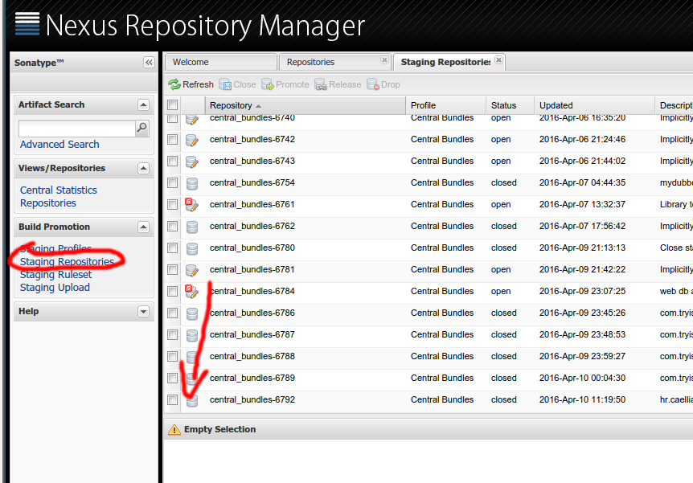
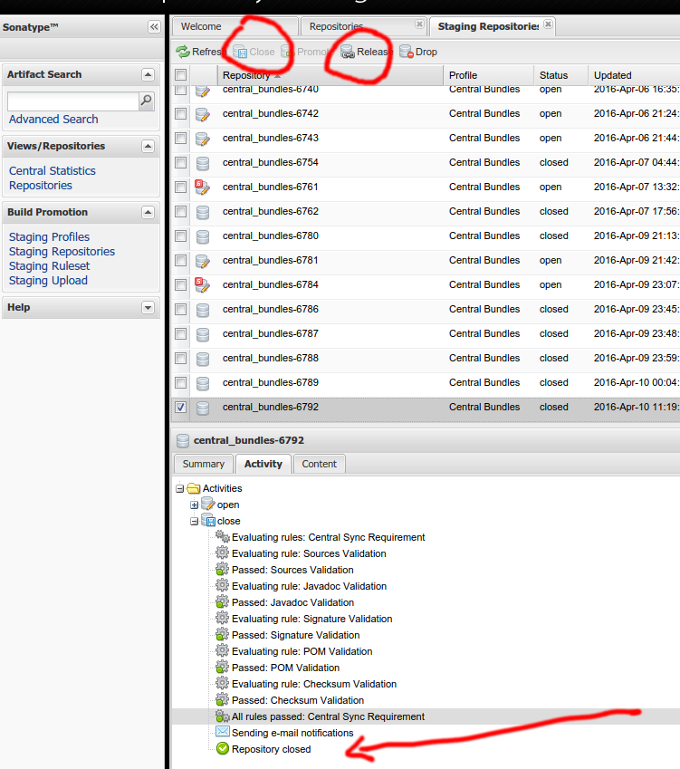

# Publishing a Scala library with SBT in Sonatype OSS for dummies:
[Pedro Larroy](https://github.com/larroy) [@plarroy](https://twitter.com/plarroy)

When you use a modern dependency management tool like maven or sbt your dependencies get downloaded
automatically. For most of us that's a magic process, most of the time it works and it's great. It
really simplifies dependency management and makes us developers very productive.

That's done through the ["central" repository](http://central.sonatype.org/), hosted by Sonatype
free of charge for [open source projects](http://central.sonatype.org/pages/ossrh-guide.html). 

Let's say you have an open source project and want to release some artifacts for other people to use
through this convenient process. This is a step-by-step guide on how to accomplish this, as the
process can be a bit involved.

## Setup sonatype account
1. Follow the two steps in [initial
setup](http://central.sonatype.org/pages/ossrh-guide.html#initial-setup)
2. [Create account](https://issues.sonatype.org/secure/Signup!default.jspa)
3. [Create a ticket](https://issues.sonatype.org/secure/CreateIssue.jspa?issuetype=21&pid=10134)
    Make sure to fill "Group Id" with your desired name or domain of your project. For example
    "org.example", let's call this $GROUP_ID
    
## Setup project sbt

In [build.sbt](https://github.com/openquant/YahooFinanceScala/blob/master/build.sbt#L3): we set
    "organization" to $GROUP_ID if this is not correct we will get a permission denied error when
    trying to release.

### build.sbt: Make sure to include a "name" for your lib, for example "mylib"

### Add the publishing boilerplate as seen in
[build.sbt](https://github.com/openquant/YahooFinanceScala/blob/master/build.sbt#L22) (Lines 22-55)
adjusting the values to your project.

### Add the "sbt-pgp" plugin globally to sbt:
```sh
mkdir -p ~/.sbt/0.13/plugins
echo 'addSbtPlugin("com.jsuereth" % "sbt-pgp" % "1.0.0")' > ~/.sbt/0.13/plugins/gpg.sbt
```

## Start sbt in your project folder
```sh
sbt
```

## Create a gpg key
```sh
sbt> pgp-cmd gen-key
```
This should create the public and private keys in ~/.sbt/gpg/

## Or import a preexisting key 
Alternatively if you have a gpg key you can import it and point the secret keyring of sbt gpg to it:
```sh
gpg --import secring.asc
$ cat .sbt/gpg.sbt
pgpSecretRing := file("/Users/xxxx/.gnupg/secring.gpg")
```
And skip the next step.

## Import the key in your gpg keyring

```sh
cd ~/.sbt/gpg/
gpg --import secring.asc
```

Copy the key ID in the output:
```
gpg: key 526BA3C6: ...
         ^^^^^^^^
```

## Import the public key into a public keyserver that central will use to verify your signed jars

```
gpg --send-keys --keyserver pgp.mit.edu 526BA3C6 pubring.asc
```

## Make sure your sonatype credentials are available to sbt, put the following in
`.sbt/0.13/sonatype.sbt`
```
credentials += Credentials("Sonatype Nexus Repository Manager",
                           "oss.sonatype.org",
                           "<your username>",
                           "<your password>")
```

## From the sbt console you can now do
```
sbt> publishSigned
```
This should upload the artifacts, .jar .pom with their respective signatures.


## Go to [Sonatype OSS](https://oss.sonatype.org/) to release 

Login by cliking on the upper right corner of the screen
When you first upload the artifacts they are in a "staging area" not yet released

Scroll down to your artifact and verify that it has the files you want, additionally you can verify the jar with `jar tvf` to check the contents


To [release our artifact](http://central.sonatype.org/pages/releasing-the-deployment.html) we need to first "Close" 


Check in the activity tab that everything is successful, or address any issues encountered
 Click "Release"
After a bit, we should be able to get the dependency in other projects by adding to the `libraryDependencies`
```scala
"org.example" %% "mylib" % "0.1"
```

That should be all, congratulations! your artifact should be available for the world at large to use!

You might want to also check the [similar guide in the SBT documentation](http://www.scala-sbt.org/0.13/docs/Using-Sonatype.html)
